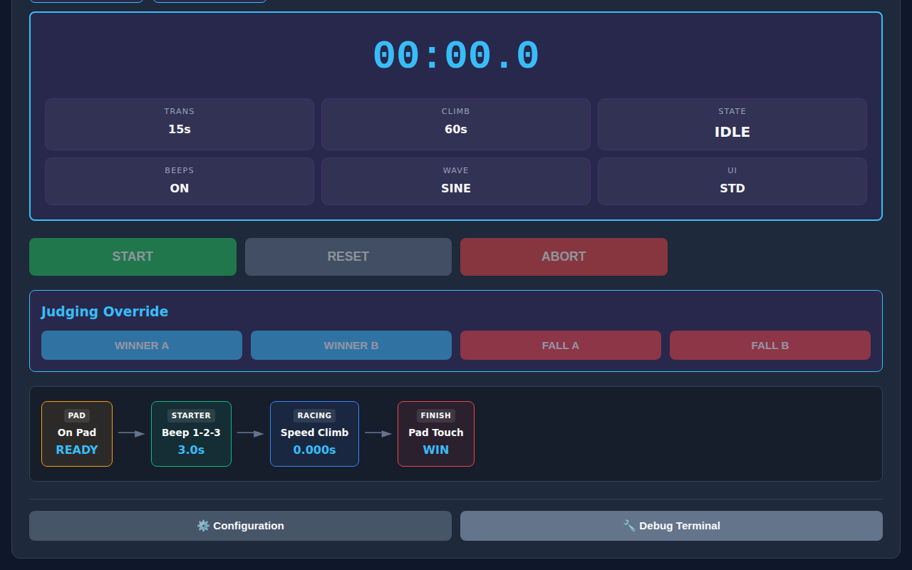

# Climbing Disciplines & Timer Modes Guide

This comprehensive guide explains how to operate the T2Climb system for every climbing discipline and training mode.

---

## ⚡ 1. Speed Climbing Mode

Speed mode follows the official **IFSC 15m Speed Climbing** format with dual-lane precision timing, automated start countdowns, and referee override controls.

### Workflow & Operation
1. **Athlete Preparation**: Both climbers step onto the start pads. The Web UI and OLED screen display `READY`.
2. **Initiate Start Sequence**:
   - **Hardware Station**: Press **Button 0** or rotate the encoder to select Start.
   - **Web UI**: Click the **START** button.
3. **Countdown Sequence**:
   - **-2.0s**: Low Pip tone (880 Hz) — Display shows `SET .`
   - **-1.0s**: Low Pip tone (880 Hz) — Display shows `SET . .`
   - **0.0s**: High "GO" Tone (1760 Hz) — Display switches to `RACING` and timer starts running.
4. **False Start Handling**:
   - Releasing the start pad within 100ms after the GO signal triggers a false start.
   - In **Finals**, the system immediately halts the race and sounds a recall alarm.
   - In **Qualifications**, the false start is visually flagged while allowing the other lane to finish cleanly.
5. **Finishing & Winners**:
   - Reaching the top pad stops the clock for that lane down to the millisecond (`SS.MMM`).
   - The winner is highlighted with a green badge and time readout.
6. **Referee Overrides**:
   - Press **WINNER A** / **WINNER B** or **FALL A** / **FALL B** on the Web UI or hardware station to manually override race results or record falls.

---

## 🧗 2. Bouldering Mode

Bouldering mode manages IFSC competition rotation intervals and gym training rotations with alternating **Climb** and **Rest/Transition** periods.

### Workflow & Operation
1. **Start Rotation**: Press **START** to begin the initial warning countdown (or climb period directly).
2. **Audio Signals & Tones**:
   - **Start Period Tone**: Medium tone (523 Hz) signals climbers to start.
   - **1-Minute Remaining Warning**: High warning tone (1760 Hz) alerts athletes when 60 seconds remain.
   - **5-Second Countdown**: Low pips (440 Hz) count down the last 5 seconds.
   - **Rotation End Tone**: End beep (880 Hz) marks rotation transition.
3. **Automated Interval Looping**:
   - When **Auto-Loop** is enabled, the timer automatically cycles through `CLIMB` ➔ `REST` ➔ `CLIMB`.
4. **Manual Controls**:
   - Use **PAUSE / RESUME** to hold timer for judge inquiries or mat cleaning.
   - Click **FINISH** to end the current attempt early.

---

## 🧗‍♂️ 3. Lead Climbing Mode

Lead mode manages IFSC single-climber lead attempts, supporting a silent **40-second Preparation Window** followed by a silent **6-minute (360s) Climbing Window**.

### Workflow & Operation
1. **40-Second Preparation**:
   - When the referee calls the athlete, press **START**.
   - A 40-second silent prep timer begins counting down.
   - If time expires without the athlete starting, a silent **DNS (Did Not Start)** indicator is logged.
2. **6-Minute Climbing Window**:
   - As soon as the climber's feet leave the mat, the 6-minute clock begins silently counting down from `06:00.0`.
3. **1-Minute Warning & Timeout**:
   - At 1 minute remaining (`01:00.0`), a single warning tone (1760 Hz) alerts the athlete.
   - At `00:00.0`, a long timeout buzzer sounds.
4. **Top / Fall Finish**:
   - Press **FINISH** or **FALL** when the climber clips the top draw or falls. Time is locked in silently with millisecond precision.

---

## 🏋️ 4. Circuit Training Mode

Circuit Training mode allows trainers and athletes to build multi-step High Intensity Interval Training (HIIT) and endurance climbing workouts.

### Workflow & Operation
1. **Designing a Workout**:
   - Set up individual steps (e.g., Step 1: 45s Climb / 15s Rest, Step 2: 30s Climb / 30s Rest).
   - Enable **Auto-Loop** to continuously repeat the full circuit or run as a single pass.
2. **Executing the Workout**:
   - Press **START** to begin the initial prep countdown (`N`).
   - The visual flow indicator highlights the active step and previews upcoming rest intervals.
   - Audible warning pips sound before every step transition.

---

## ⏱️ 5. Clock & Stopwatch Mode

Clock mode serves as a general-purpose gym wall clock, count-up stopwatch, and dual-lane split timer.

### Workflow & Operation
1. **Wall Clock Operation**: Displays synchronized real-time clock (RTC) time with configurable timezone support.
2. **Stopwatch Operation**:
   - Press **START** to count up from `00:00.0`.
   - Press **WINNER A** or **WINNER B** to log split times for individual lanes without stopping the master clock.
   - Click **RESET** to clear stopwatch time back to zero.
