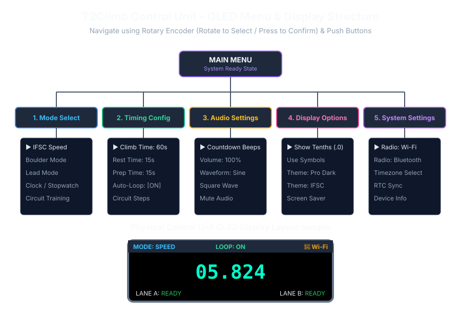

# Hardware Unit & OLED Display Guide

The physical T2Climb Hardware Station is powered by an ESP32 micro-controller featuring an OLED screen, rotary encoder navigation, high-decibel audio synthesizer, push buttons, and CAN bus sensor ports.

---

## 🎛️ Physical Controls & Button Mappings

- **Rotary Encoder**:
  - **Rotate Knob**: Scroll through menu selections or adjust parameter values (volume, duration, mode).
  - **Press Knob**: Select menu items or toggle configuration settings.
- **Button 0 (Starter / Action)**:
  - Short Press: Start countdown, trigger prep timer, or advance workout phase.
- **Button 1 (Reset)**:
  - Short Press: Reset active timer to initial state.
- **Button 2 (Lane A / Judge A)**:
  - Short Press: Record top sensor hit / declare winner for Lane A (Left Lane) or capture split time.
- **Button 3 (Lane B / Judge B)**:
  - Short Press: Record top sensor hit / declare winner for Lane B (Right Lane) or capture split time.

---

## 📺 OLED Screen Layout & Menu Navigation

The OLED screen provides real-time information and menu navigation even without a smartphone connected.

### OLED Screen Header Bar
- **Mode Badge**: Displays active discipline (`SPEED`, `BOULDER`, `LEAD`, `CLOCK`, `CIRCUIT`).
- **Loop Indicator**: Shows `LOOP: ON` or `LOOP: OFF`.
- **Radio Indicator**: Shows communication status (`📶 Wi-Fi` or `ᛒ BLE`).

### OLED Main Display & Footer
- **Main Digits**: Clear, high-contrast time readout (`MM:SS.t` or `SS.MMM`).
- **Lane Badges**: Real-time status for Lane A and Lane B (`READY`, `RACING`, `WIN`, `FALSE`, `FALL`).

### Menu Hierarchy
1. **Mode Select**: Switch timer modes (Speed, Boulder, Lead, Clock, Circuit).
2. **Timing Config**: Adjust active climb duration, transition duration, and prep countdowns.
3. **Audio Settings**: Toggle countdown pips, adjust volume slider (0-100%), and select synthesizer waveform (Warm Sine vs. Sharp Square).
4. **Display Options**: Toggle fractional tenths, graphical icons, and display contrast themes.
5. **System Settings**: Toggle Wi-Fi / BLE radio modes, configure timezone, and check unit diagnostics.
