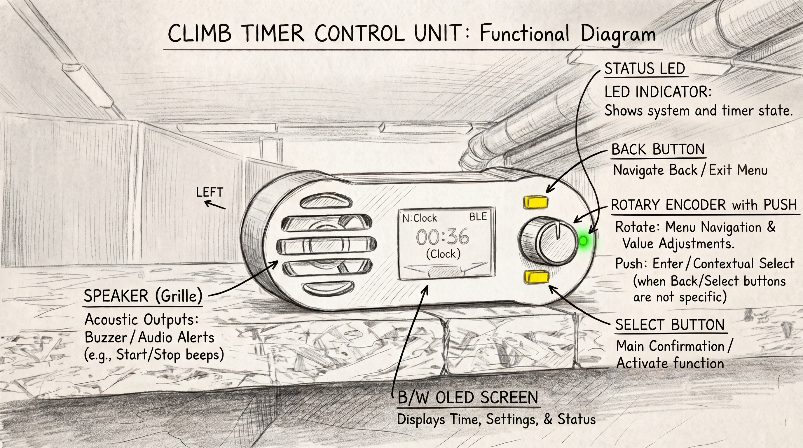
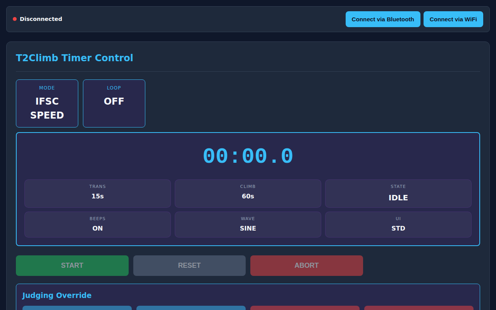

# T2Climb Timer System User Guide

Welcome to the **T2Climb Timer System Manual**! Designed for climbing gyms, event organizers, routesetters, coaches, trainers, and athletes, the T2Climb system delivers precise timing, automated rotations, and live telemetry for training sessions and official competitions.

---

## 🚀 Quick Start Guide

### 1. Power On & Hardware Controls
- Connect the T2Climb Control Unit to power using the USB-C or power input.
- Use the **Rotary Encoder** (rotate to navigate, press to select) to navigate menus directly on the OLED screen.
- Front panel push buttons provide instant actions:
  - **Button 0 (Starter / Action)**: Start timer, trigger prep, or advance state.
  - **Button 1 (Reset)**: Reset timer to initial state.
  - **Button 2 (Lane A / Judge A)**: Stop timer for Lane A / Record Top or Split.
  - **Button 3 (Lane B / Judge B)**: Stop timer for Lane B / Record Top or Split.

### 2. Connect the Web Control UI (`timer-ctrl`)
Open the T2Climb Web Application on your smartphone, tablet, or laptop:
- **Bluetooth Connection**: Click **Connect via Bluetooth** to pair directly with the control station.
- **Wi-Fi Connection**: Connect to the station's Wi-Fi network and click **Connect via WiFi**.

---

## 📚 User Manual Contents

Navigate through the following user guides tailored for gym management, coaching, and athlete workflows:

1. **[Climbing Disciplines & Timer Modes](Disciplines.md)**
   - Speed Climbing (IFSC start sequence, dual lane false start rules, referee controls).
   - Bouldering (Automated climb/rest intervals, rotation tones, manual pauses).
   - Lead Climbing (40s prep timer, silent 6-minute window, 1-minute warning tone).
   - Circuit Training (Custom multi-step interval workouts & HIIT routines).
   - Clock & Stopwatch (Gym wall clock, count-up stopwatch, split times).

2. **[Web UI & Remote Control Guide](Web-UI-Guide.md)**
   - Overview of the web dashboard layout.
   - Adjusting climb durations, rest intervals, and volume sliders.
   - Managing multi-lane setups and UI display themes.

3. **[Hardware Unit & OLED Display Guide](Hardware-Guide.md)**
   - Physical button mappings and rotary encoder menu hierarchy.
   - OLED screen layout, status badges, and audio tone descriptions.

4. **[Technical & Protocol Reference](Technical-Reference.md)**
   - *(For developers & technical operators)* Protocol specifications, G-code parameters, serial/BLE event codes, and hardware API documentation.
