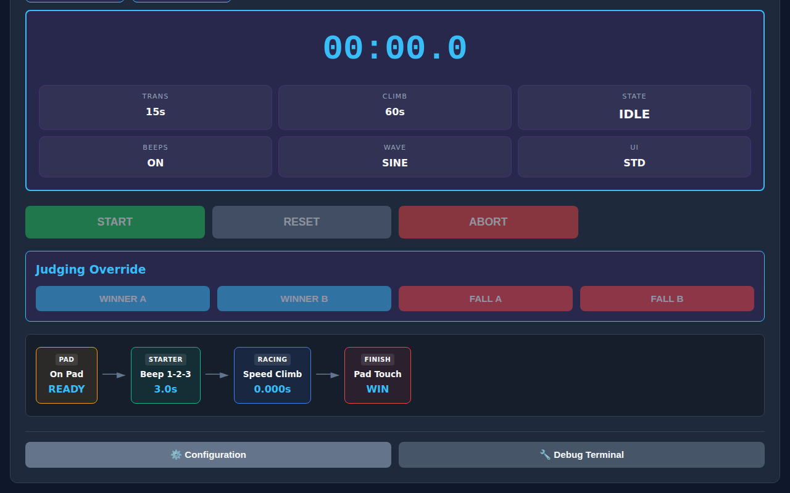

# Technical Reference Guide

This document serves as the technical API reference for developers, event engineers, and system integrators operating or extending the T2Climb Timer hardware and protocol.

---

## 🛰️ Protocol Architecture

The T2Climb system utilizes a symmetric ASCII G-code style protocol over Bluetooth Low Energy (NUS GATT Service) and Wi-Fi (HTTP POST `/cmd` and Server-Sent Events `/events`).

### G-Code Command Syntax

| Command | Category | Description | Example |
| :--- | :--- | :--- | :--- |
| `G` | Query | Queries all current system configuration parameters | `G` |
| `C <key><val>` | Set Config | Sets one or more configuration parameter keys | `C M0 C300 V100` |
| `S` | Status | Queries device state machine, mode, and UUID | `S` |
| `E<code> <ts> [args]` | Event | Triggers system event or button press | `E6 0` |
| `R` | Reset | Resets system state machine back to READY | `R` |
| `TME [YYYY-MM-DD HH:MM:SS]` | RTC Time | Queries or sets hardware RTC date/time | `TME 2026-10-08 14:00:00` |
| `TZ [posix_string]` | Timezone | Queries or sets POSIX timezone string | `TZ EET-2EEST,M3.5.0/3,M10.5.0/4` |
| `RADIO [WIFI\|BLE]` | Radio | Queries or sets communication radio backend | `RADIO BLE` |
| `!` | Reboot | Soft reboots the microcontroller | `!` |

---

## ⚙️ Configuration Parameter Keys (`C <key><val>`)

| Key | Description | Values / Range | Default |
| :--- | :--- | :--- | :--- |
| `M` | Climb Mode | `0`: Speed, `1`: Boulder, `2`: Lead, `3`: Clock, `4`: Circuit | `0` |
| `C` | Climb Duration | `1` to `3600` seconds | `60` |
| `T` | Transition / Rest Duration | `0` to `3600` seconds | `15` |
| `N` | Initial Warning / Prep Duration | `0` to `3600` seconds | `15` |
| `Q` | Auto-Loop Mode | `0`: Single pass, `1`: Continuous auto-loop | `0` |
| `V` | Audio Master Volume | `0` to `100` (%) | `100` |
| `B` | Countdown Beeps | `0`: Disabled, `1`: Enabled | `1` |
| `W` | Audio Synthesizer Waveform | `0`: Warm Sine, `1`: Sharp Square | `0` |
| `X` | Show Tenths Digit | `0`: Hidden, `1`: Visible | `1` |
| `Y` | Use Graphical Symbols | `0`: Text, `1`: Icons | `0` |
| `K` | Maintenance Mode | `0`: Normal, `1`: Service mode | `0` |
| `U` | UI Theme | `0`: Pro Dark, `1`: IFSC Official | `0` |
| `H` | Lane A Active | `0`: Disabled, `1`: Enabled | `1` |
| `J` | Lane B Active | `0`: Disabled, `1`: Enabled | `1` |
| `A` | Controller Assigned Lane | `0`: Global (Both), `1`: Lane A, `2`: Lane B | `0` |
| `CS` | Circuit Sequence | Comma-separated `<climb>/<rest>` pairs (e.g. `30/15,45/15`) | `30/15,30/15` |

---

## 💻 Debug Terminal Usage

The Web UI includes a built-in interactive Debug Terminal accessible by clicking **🔧 Debug Terminal** in the main screen footer.

### Features:
- Real-time logging of outbound (`TX >`) and inbound (`RX <`) serial frames with millisecond timestamps.
- Direct command entry box for sending raw G-code strings.
- **Save Log**: Exports formatted log history to a `.txt` file for telemetry diagnosis.
